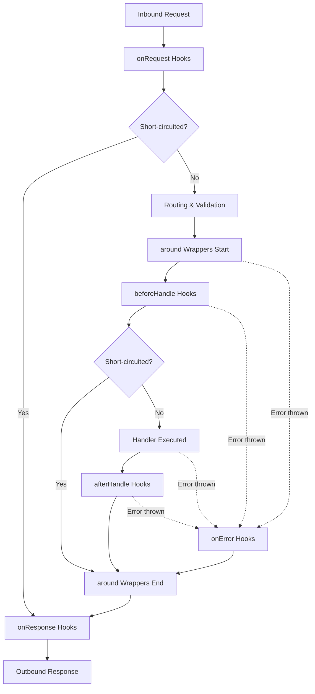

Nifra is designed to be modular without hiding the type surface from TypeScript.
You can extend the framework in three ways:

1. **Custom middleware**: lifecycle hooks for cross-cutting behavior such as headers, logging, telemetry, CORS, or rate limiting.
2. **Typed plugins (`definePlugin`)**: reusable units that extend the request `Context` with `.derive()` or `.decorate()`, then carry those types to downstream route handlers.
3. **Identity plugins (`defineIdentityPlugin`)**: named side-effect plugins for hooks or runtime-mounted handlers that must preserve the caller's exact server type across `.use()`.

---

## Middleware

A middleware is a flat object containing optional lifecycle hooks that map to points in the request execution cycle.
It is ideal for cross-cutting concerns that do not need to alter the handler's typed context.

```ts
import type { Middleware } from "@nifrajs/core"

export function requestTiming(): Middleware {
  return {
    // Used for idempotent deduplication when the middleware is applied twice.
    name: "request-timing",

    // Wraps matched route execution. Return `next()`'s value so normal serialization still applies.
    async around(c, next) {
      const started = performance.now()
      try {
        return await next()
      } finally {
        c.set.headers["server-timing"] = `app;dur=${(performance.now() - started).toFixed(1)}`
      }
    }
  }
}
```

Apply it using `.use()`:
```ts
import { server } from "@nifrajs/core"
import { requestTiming } from "./requestTiming"

const app = server()
  .use(requestTiming())
```

---

## Typed Plugins

When your plugin needs to extend the request context (`c`) with new properties (for example database handles, user sessions, request IDs, or feature flags), use `definePlugin`.

`definePlugin` maps an input `Server` type to an output `Server` type, allowing `.derive()` or `.decorate()` calls to propagate their type changes.

### Example: Request ID Plugin

Here is how to build a request ID plugin that generates a UUID, appends it to `c.requestId`, and adds it as a response header.

```ts
import { definePlugin } from "@nifrajs/core"

export interface RequestIdOptions {
  header?: string
}

export function requestId(options: RequestIdOptions = {}) {
  const header = options.header ?? "x-request-id"
  
  // Wrap with definePlugin to name the plugin and preserve generic type inference
  return definePlugin("requestId", (app) =>
    app.derive((c) => {
      const id = c.req.headers.get(header) ?? crypto.randomUUID()
      c.set.headers[header] = id // Set on outgoing response
      
      // Return the context extension
      return { requestId: id }
    })
  )
}
```

### Usage:
```ts
import { server } from "@nifrajs/core"
import { requestId } from "./requestId"

const app = server()
  .use(requestId()) // c.requestId is now typed
  .get("/ping", (c) => {
    return { pong: true, id: c.requestId } // Fully typed!
  })
```

---

## Identity Plugins

If your plugin registers hooks, mounts runtime handlers, or performs other side effects but **does not** change the caller's typed context or typed route registry, use `defineIdentityPlugin`.

This is especially useful for integrations such as auth catch-all handlers: they need runtime routes, but they should not widen the app type or erase typed client inference for the routes declared before and after `.use()`.

If you need the plugin's own routes to become part of the typed public API, expose a transforming plugin that returns the typed result of `app.get(...)`, `app.post(...)`, and so on. Use an identity plugin only when the type-level API surface should stay unchanged.

### Example: Audit Hook Plugin
```ts
import { defineIdentityPlugin } from "@nifrajs/core"

export const auditHeaders = defineIdentityPlugin("audit-headers", (app) => {
  return app.onResponse((res) => {
    res.headers.set("x-audit", "enabled")
    return res
  })
})
```

### Usage:
```ts
import { server } from "@nifrajs/core"
import { auditHeaders } from "./auditHeaders"

const app = server()
  .use(auditHeaders) // Routes before and after this line keep their exact types
  .get("/users/:id", (c) => ({ id: c.params.id })) 

// The client built from app remains fully typed for "/users/:id".
```

---

## Lifecycle Execution Order

When a request arrives, the lifecycle hooks run in the following sequence:



1. **`onRequest`**: Runs before routing or validation. Returning a `Response` halts execution and goes straight to `onResponse`.
2. **Routing & Validation**: Path parameters are extracted, and query/body schemas are validated. If validation fails, Nifra creates a structured `400` response through the same error-routing path.
3. **`around` (Start)**: Wraps the execution of the route handler and subsequent hooks.
4. **`beforeHandle`**: Runs after validation but before the handler. Returning a value other than `undefined` bypasses the handler and goes to `afterHandle`.
5. **Route Handler**: Your registered handler function executes.
6. **`afterHandle`**: Receives and transforms the handler's return value.
7. **`around` (End)**: Resolves the wrapper.
8. **`onError`**: If validation, `beforeHandle`, the handler, or `afterHandle` throws a regular error, the `onError` hooks run sequentially. Returning a value other than `undefined` replaces the default flat `500` response. A thrown `Response` is deliberate control flow and is returned as-is.
9. **`onResponse`**: Runs on **every** response (including 404s, 405s, validation errors, and runtime errors) immediately before sending. Receives the `Response` and must return a `Response`.

---

## Idempotency and Deduplication

To prevent duplicate execution (e.g., if plugin `A` and plugin `B` both depend on a shared `db` plugin), Nifra tracks registered plugin and middleware names:

- **For Plugins**: The string name passed as the first argument to `definePlugin` or `defineIdentityPlugin` is used as a unique key.
- **For Middlewares**: The `name` property on the middleware object is used.

If a plugin/middleware name is already registered in the server's internal `appliedPlugins` set, subsequent `.use()` calls for it will be a silent no-op.
